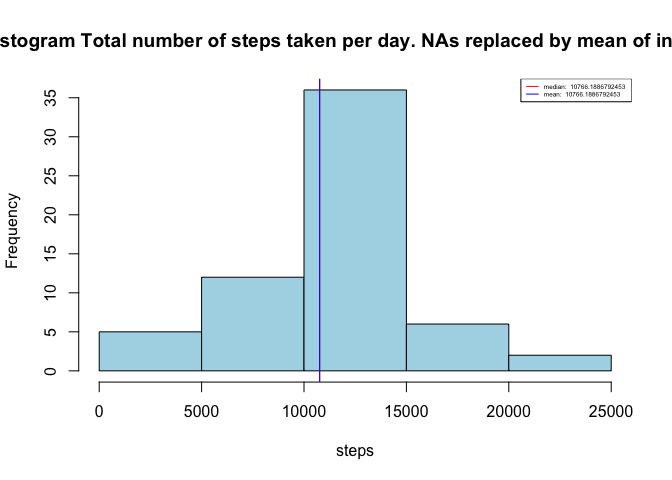

# Reproducible Research: Peer Assessment 1

## Loading and preprocessing the data

```r
Sys.setlocale("LC_TIME", "C")
```

[1] "C"

```r
dataFileNAme="activity.zip"
unzip(dataFileNAme)
reprodata <- read.csv("activity.csv",header = TRUE)
totalStepPerDay <- sapply(split(reprodata,reprodata$date),function(x) sum(x$steps,na.rm=TRUE))
medianStepPerDay <- median(totalStepPerDay,na.rm=TRUE)
meanStepPerDay <- mean(totalStepPerDay,na.rm=TRUE)

vmedian_text=paste("median: ",medianStepPerDay)
vmean_text=paste("mean: ",meanStepPerDay)
library(reshape2)

reprodataReshaped=melt(reprodata[,c("interval","steps")],id="interval", measure.vars=c("steps"),variable.name="steps", na.rm=TRUE)
reprodataMean= dcast(reprodataReshaped, interval~ steps,mean)
 

require(ggplot2)
```

```
## Loading required package: ggplot2
```

```r
require(plyr)
```

```
## Loading required package: plyr
```


## What is mean total number of steps taken per day?

1. Make a histogram of the total number of steps taken each day


```r
hist(totalStepPerDay,col="light green",main="Histogram Total number of steps taken per day", xlab="steps")
abline(v=meanStepPerDay,col="red")
abline(v=medianStepPerDay,col="blue")
legend("topright", cex=0.5,col=c("red","blue"), lty=c(1,1), legend=c(vmedian_text,vmean_text))
```

 


2. Calculate and report the mean and median total number of steps taken per day


  Median is:

```r
medianStepPerDay
```

[1] 10395


Mean is: 

```r
meanStepPerDay
```

```
## [1] 9354
```


## What is the average daily activity pattern?

1. Make a time series plot (i.e. type = "l") of the 5-minute interval (x-axis) and the average number of steps taken, averaged across all days (y-axis)

```r
ggplot(reprodataMean, aes(interval,steps)) + geom_line(color="blue")+ labs(title="steps average daily activity")+ labs(x="5-minute interval")+ labs(y="averaged across all days")  
```

 

2. Which 5-minute interval, on average across all the days in the dataset, contains the maximum number of steps?

    Interval with maximal number of steps: 


```r
max <- reprodataMean[reprodataMean$steps ==max(reprodataMean$steps),]

max$interval[1]
```

```
## [1] 835
```


## Imputing missing values

1. Calculate and report the total number of missing values in the dataset (i.e. the total number of rows with NAs)


```r
numberOfNa <- length(which((is.na(reprodata))))
numberOfNa
```

```
## [1] 2304
```

2.  Strategy for filling in all of the missing values in the dataset:

    - The missing value will be replaced with the mean for that 5-minute interval.

3. Create a new dataset that is equal to the original dataset but with the missing data filled in.


```r
reprodataFilled <- reprodata
numRow <- nrow(reprodataFilled)
j =1
numberOfReplacedNa=0
for(i in 1:numRow){
   
  if(is.na(reprodataFilled$steps[i])){
    reprodataFilled$steps[i] = reprodataMean$steps[j]
     numberOfReplacedNa=numberOfReplacedNa+1
  }
  j=j+1
  if(j==289){
    j=1
  }
}
head(reprodataFilled,n=10)
```

```
##      steps       date interval
## 1  1.71698 2012-10-01        0
## 2  0.33962 2012-10-01        5
## 3  0.13208 2012-10-01       10
## 4  0.15094 2012-10-01       15
## 5  0.07547 2012-10-01       20
## 6  2.09434 2012-10-01       25
## 7  0.52830 2012-10-01       30
## 8  0.86792 2012-10-01       35
## 9  0.00000 2012-10-01       40
## 10 1.47170 2012-10-01       45
```

4.     Make a histogram of the total number of steps taken each day

```r
totalStepPerDayFilled <- sapply(split(reprodataFilled,reprodataFilled$date),function(x) sum(x$steps,na.rm=FALSE))

medianStepPerDayFil <- median(totalStepPerDayFilled,na.rm=TRUE)
meanStepPerDayFil <- mean(totalStepPerDayFilled,na.rm=TRUE)

vmedian_text=paste("median: ",medianStepPerDayFil)
vmean_text=paste("mean: ",meanStepPerDayFil)


hist(totalStepPerDayFilled,col="light blue",main="Histogram Total number of steps taken per day. NAs replaced by mean of interval.", xlab="steps")
abline(v=meanStepPerDayFil,col="red")
abline(v=medianStepPerDayFil,col="blue")
legend("topright", cex=0.4,col=c("red","blue"), lty=c(1,1), legend=c(vmedian_text,vmean_text))
```

 


- Calculate and report the mean and median total number of steps taken per day.
Mean is :

```r
meanStepPerDayFil
```

```
## [1] 10766
```

Median is: 

```r
medianStepPerDayFil
```

```
## [1] 10766
```


- Do these values differ from the estimates from the first part of the assignment? 

The values differ from those estimated in the first part

```r
meanStepPerDayFil < meanStepPerDay && medianStepPerDayFil< medianStepPerDay 
```

```
## [1] FALSE
```

- What is the impact of imputing missing data on the estimates of the total daily number of steps?

    Removing the NAs biases the results. Mean and median appear to be greater than they are.

## Are there differences in activity patterns between weekdays and weekends?

 - Create a new factor variable in the dataset with two levels – “weekday” and “weekend” indicating whether a given date is a weekday or weekend day.


```r
weekDays<-c("Monday","Tuesday","Wednesday","Thursday","Friday")
#weekEnd <-c("Saturday","Sunday")
 
reprodataFilled <-transform(reprodataFilled,daytype = factor( x=ifelse(weekdays(as.Date(reprodataFilled$date)) %in% weekDays,"weekday","weekend"),levels = c("weekday","weekend") ))
summary(reprodataFilled)
```

```
##      steps               date          interval       daytype     
##  Min.   :  0.0   2012-10-01:  288   Min.   :   0   weekday:12960  
##  1st Qu.:  0.0   2012-10-02:  288   1st Qu.: 589   weekend: 4608  
##  Median :  0.0   2012-10-03:  288   Median :1178                  
##  Mean   : 37.4   2012-10-04:  288   Mean   :1178                  
##  3rd Qu.: 27.0   2012-10-05:  288   3rd Qu.:1766                  
##  Max.   :806.0   2012-10-06:  288   Max.   :2355                  
##                  (Other)   :15840
```

```r
head(reprodataFilled)
```

```
##     steps       date interval daytype
## 1 1.71698 2012-10-01        0 weekday
## 2 0.33962 2012-10-01        5 weekday
## 3 0.13208 2012-10-01       10 weekday
## 4 0.15094 2012-10-01       15 weekday
## 5 0.07547 2012-10-01       20 weekday
## 6 2.09434 2012-10-01       25 weekday
```


  
- Make a panel plot containing a time series plot (i.e. type = "l") of the 5-minute interval (x-axis) and the average number of steps taken, averaged across all weekday days or weekend days (y-axis). The plot should look something like the following, which was creating using simulated data:
We first melt and recast the data in order to bring it into a form that suitable for plotting:

```r
copyFilled <- reprodataFilled
copymelt <-  melt(copyFilled ,id=c("interval","date"), measure.vars=c("steps"),variable.name="steps", na.rm=TRUE)

copymeltMutate<-mutate(copymelt,daytype = factor( x=ifelse(weekdays(as.Date(copymelt$date)) %in% weekDays,"weekday","weekend"),levels = c("weekday","weekend") ))

copymeltMean= dcast(copymeltMutate, interval+daytype ~ steps,mean)
```

and then make the panel plot:

```r
#  qplot(interval,value,data=reprodataFilledReshaped,facets= daytype ~ .,geom =c("line","smooth"),color=daytype)
# require(lattice)
# xyplot(reprodataFilledReshaped$value ~ reprodataFilledReshaped$interval | reprodataFilledReshaped$daytype, layout=c(2,1))


ggplot(copymeltMean, aes(interval,steps)) + geom_line(aes(color = daytype))+geom_smooth(method="auto")+facet_grid(. ~ daytype)+ labs(title="steps average daily activity")+ labs(x="5-minute interval")+ labs(y="averaged across all days")  
```

```
## geom_smooth: method="auto" and size of largest group is <1000, so using loess. Use 'method = x' to change the smoothing method.
## geom_smooth: method="auto" and size of largest group is <1000, so using loess. Use 'method = x' to change the smoothing method.
```

 

